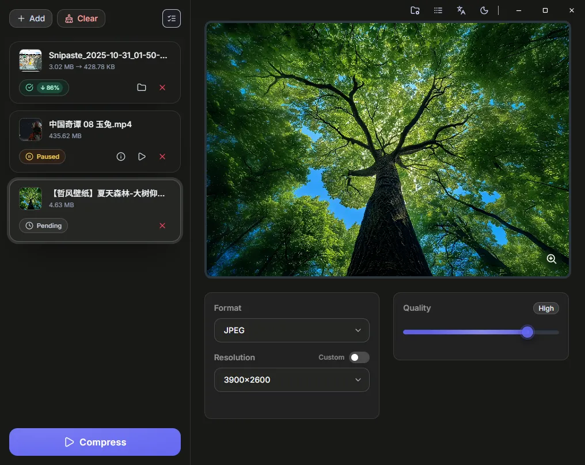

<p align="left"><strong>English</strong> | <a href="./README.zh.md">中文</a></p>

<p align="center">
  
</p>
<h1 align="center">Ziki</h1>
<p align="center">
  
  
  
  
</p>


> Simple, fast, private. Compress images and videos locally and offline.

---

## ✨ Key Features

- Image and video compression: Optimize size and transcode common image and video formats, including compression to animated AVIF
- Batch processing and task queue: Add multiple files at once, with queueing, status filtering, and cleanup
- customization: Flexibly balance size and clarity
- Hardware acceleration detection: Automatically detects available hardware encoders and prioritizes them
- Local and offline: All processing is done locally; no files are uploaded
- Drag-and-drop and native dialogs: Drag to add files, or use the system's native picker
- Preview and comparison: Quickly preview and compare before and after compression
- Output path and naming: Customize output directory and file naming (original name/timestamp/random)
- Multi-language and theme: Supports Chinese/English, light/dark/auto themes
- Cross-platform: macOS, Windows

## 📋 System Requirements

- **macOS**: 10.15 (Catalina) or later
- **Windows**: 8 or later
- **FFmpeg**: Integrated FFmpeg 7.1 - no local installation required

## 🖼️ Screenshots

### Demo
<div>
  
</div>

### macOS
<div>
  
</div>

### Windows
<div>
  
</div>

## 🚀 Development

Requires Node.js, pnpm, and a Rust environment.

```bash
pnpm i
pnpm tauri dev
```

Build release:

```bash
pnpm i
pnpm tauri build
```


## 🙏 References

- CompressO (open-source cross-platform video compression app): https://github.com/codeforreal1/compressO
- Rotato Video Compressor (FFmpeg-based online/offline compression tool): https://tools.rotato.app/compress
- HandBrake: https://github.com/HandBrake/HandBrake
- FFmpeg binary downloads: https://ffmpeg.martin-riedl.de/
