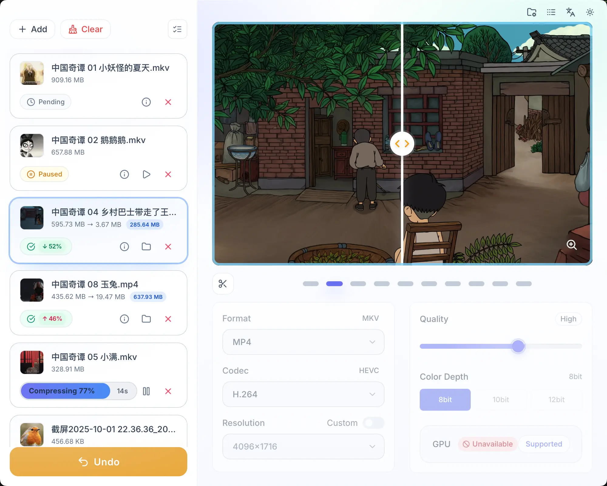

<p align="center">
  
</p>
<h1 align="center">Ziki · 即刻压缩</h1>
<p align="center">
  
  
  
  
</p>

> 简洁、快速、私密。本地离线完成图片与视频压缩，兼顾画质与体积，适合日常分享与归档。

---

## ✨ 功能亮点

- 图片与视频压缩：支持常见图片、视频格式的体积优化与转码
- 批量处理与任务队列：一次添加多文件，支持队列、状态筛选与清理
- 质量预设与自定义：在体积与清晰度之间灵活平衡（预设 + 手动参数）
- 硬件加速检测：自动检测可用的硬件编码能力并优先使用
- 本地离线：所有处理均在本地完成，不上传任何文件
- 拖拽与原生对话框：拖拽添加文件，或使用系统原生选择器
- 预览与对比：压缩前后可快速预览、对比差异
- 输出路径与命名：自定义输出目录与文件命名规则（原名/时间戳/随机）
- 多语言与主题：支持中文/英文，明暗/自动主题
- 跨平台：macOS、Windows

## 🖼️ 截图

<div>
  
</div>

<div>
  
</div>

## 🚀 开发

需要 Node.js、pnpm 与 Rust 环境。

```bash
pnpm install
pnpm tauri dev
```

构建发行版：

```bash
pnpm install
pnpm tauri build
```

## 🖍️ 图标

项目图标文件位于 `src-tauri/icons/`，顶部展示的图标来自 `./assets/icon.svg`：
- 源文件（SVG）：`src-tauri/icons/icon.svg`
- macOS（ICNS）：`src-tauri/icons/icon.icns`
- Windows（ICO）：`src-tauri/icons/icon.ico`

## 🙏 参考

- CompressO（开源跨平台视频压缩 App）：https://github.com/codeforreal1/compressO
- Rotato Video Compressor（基于 FFmpeg 的在线/离线压缩工具）：https://tools.rotato.app/compress
- HandBrake：https://github.com/HandBrake/HandBrake